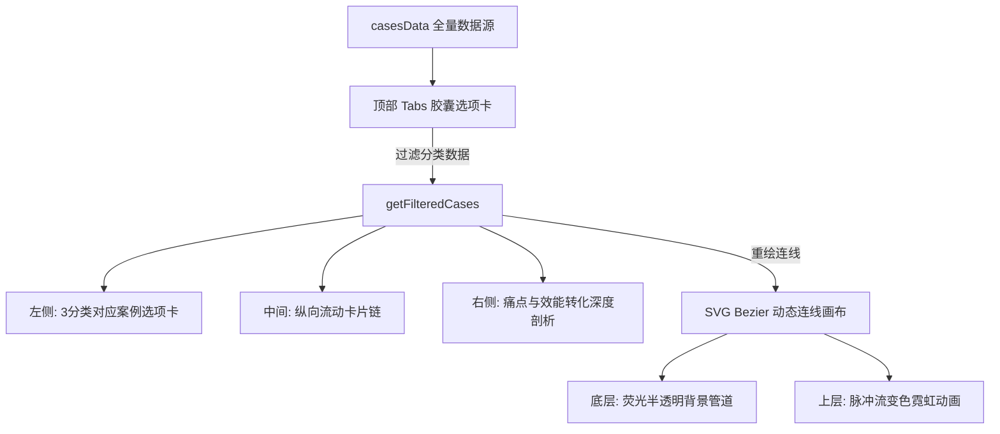

# AI 游戏广告创意工作流交互大屏 ── 项目状态与技术文档 (AI Workflow Status)

本文件系统性地归档了 **“AI 游戏广告创意工作流交互大屏”** 这一高精尖前端项目的诞生背景、用户核心需求、技术实现细节、模型 Skills 应用以及**跨设备 Agent 快速接手指南**。

---

## 一、 用户原始需求与分类体系

### 1. 业务目标
将游戏生产与广告投放中零散的 **12 大核心 AI 工业化工作流** 串联并整合，划分为**创意生成**、**自动化提效**、**知识库构建**三大模块，形成一套高可读性、高视觉冲击力、且具备演示说服力的**三分类前端交互大屏**，用于对外展示和团队内部流程规范。

### 2. 三大核心类别与 12 大管线定义

#### A. AI 创意生成 (Category: `creative` / 专属极客蓝粉霓虹)
1. **衍生创意视频管线**（基于参考视频进行游戏元素的智能克隆与即梦画布生成）。
2. **角色剧情动画分镜管线**（长文案大纲 ➔ 完整分镜 ➔ 即梦 2.0 剧情图生图 ➔ 剪映后期合成）。
3. **知识库驱动福利宣传管线**（专属游戏玩法与福利知识库 ➔ GPT 生成脚本 ➔ GPT 图像批量渲染 ➔ 自动化设计生成）。
4. **长攻略/直播转信息流广告管线**（长直播录屏 ➔ ASR 语音提取转录 ➔ AI 黄金三秒文案 ➔ 高拟真 TTS ➔ 剪映匹配切片导出）。
5. **战机进阶与合成演示动画管线**（树状合成数据 ➔ Claude Code 编写 Web 动效 ➔ 浏览器高帧率渲染 ➔ Hyper Farm 无损超清录屏）。
6. **大批量图标排版与布局管线**（多属性图标数据 ➔ 布局约束知识库 ➔ 遮罩与坐标描述 ➔ 绘图引擎精准渲染）。

#### B. AI 自动化提效 (Category: `efficiency` / 专属生态翡翠绿霓虹 / 基于 Hyper Farm 智能提效)
7. **素材智能自动化管理**（自研 AI 批量重命名工具，自动识别文件夹内图片、视频、多图组等，按预设标签规则智能重命名与自动分类归档，解放手动工作）。
8. **日报 & 办公流程自动化**（打通素材产出记录、工作群聊天数据，AI 自动提炼每日工作内容、生成标准化日报；对接邮箱服务实现日报一键自动定时发送）。
9. **美术资源自动化巡检同步**（搭建自动化资源报表脚本，定时扫描公共盘美术素材更新，自动分类梳理资源路径、生成更新报告并推送至指定负责人/工作群）。

#### C. AI 知识库构建 (Category: `knowledge` / 专属落日琥珀金霓虹 / 基于 Google NotebookLM)
10. **美术资产元数据知识库**（海量美术设计盘 ➔ 智能扫描特征提取 ➔ 语义向量知识库 ➔ 多端协同问答与自然语言检索终端）。
11. **买量反馈与投放策略知识库**（渠道投放流水数据 ➔ 自动识别高 ROI 分镜片段与文案词 ➔ 爆款创意知识库 ➔ 一键智能生成买量剧本大纲）。
12. **版本策划与规则配置知识库**（游戏数值 Excel、GDD ➔ 规则冲突与配置边界校验 ➔ 策划逻辑规则向量库 ➔ 实时问答与自动差分）。

### 3. 用户限定规则
* **独立渲染**：无需后端合成视频，直接在前端浏览器中高帧率渲染，保障极致的流畅度和响应式。
* **物理布局**：流程图采用 **垂直（纵向）流式布局 (`flex-direction: column`)**，中间用数据管道连线穿联，并配备灵动的霓虹流光脉冲动画。
* **三类别胶囊导航**：顶部配置精美毛玻璃磨砂 Tabs，切换类别时全屏主题配色无缝重塑（包括卡片悬停边缘、发光阴影及 SVG 连线流光）。
* **高精度品牌图标**：流程图中所有外部工具必须完美匹配其官方的最新 Logo 设计，涉及：
  * **即梦 (Dreamina)** / **剪映 (CapCut)** / **ChatGPT (GPT-4o)** / **Google NotebookLM** / **UGC/PGC (长视频)** / **Claude** / **Hyper Farm (HyperFrames)**。

---

## 二、 交互大屏技术方案与架构

大屏采用 **HTML5 + Vanilla CSS + GSAP 物理动画库** 构建，整体是一个单文件绿色版（Standalone）系统，无任何外部构建依赖，即开即用。



### 1. 核心视觉设计系统与变色配色体系 (Dynamic CSS Theme System)
* **毛玻璃材质**：基于高透光率的半透明背景（`rgba(255, 255, 255, 0.03)`）配合 `1px` 白色微光边框与 `backdrop-filter: blur(20px)`，卡片背后带有暗色投影。
* **全生命周期三类别主题色**：
  * **AI 创意生成** (默认)：极客蓝粉（`#FF2E93` 与 `#4285F4` 融合，霓虹发光 `#a855f7`）。
  * **AI 自动化提效**：翡翠生态绿（`#10b981`，霓虹发光 `#10b981`）。
  * **AI 知识库构建**：琥珀熔岩黄（`#f59e0b`，霓虹发光 `#f59e0b`）。
* **CSS 样式定义**：
  ```css
  /* 三类别专属霓虹发光边框及背景辉光 */
  .category-tabs .tab-btn.active[data-category="creative"] {
    border-color: #a855f7;
    box-shadow: 0 0 12px rgba(168, 85, 247, 0.4);
  }
  .category-tabs .tab-btn.active[data-category="efficiency"] {
    border-color: #10b981;
    box-shadow: 0 0 12px rgba(16, 185, 129, 0.4);
  }
  .category-tabs .tab-btn.active[data-category="knowledge"] {
    border-color: #f59e0b;
    box-shadow: 0 0 12px rgba(245, 158, 11, 0.4);
  }
  ```

### 2. 动态 SVG 贝塞尔物理连线与重绘引擎
连接线采用独立的 SVG 浮层画布渲染，并在窗口缩放（`resize`）和节点入场动画期间动态重新计算，以实现绝对的对齐精度。
* **连接路径算法**：
  从上方卡片的 **底端中心点 $(X_1, Y_1)$** 连线到下方卡片的 **顶端中心点 $(X_2, Y_2)$**。使用三次贝塞尔曲线确保连线弯曲度优美、平滑：
  $$PathD = M\ X_1\ Y_1\ C\ X_1\ (Y_1 + dy \times 0.4),\ X_2\ (Y_2 - dy \times 0.4),\ X_2\ Y_2$$
  *(其中 $dy = Y_2 - Y_1$)*
* **变色流光特效**：
  切换分类时，JavaScript 会自动获取当前案例的 `accent` 颜色，并实时注入到 SVG 霓虹路径（`.connection-path-pulse`）的 `stroke` 和 `filter: drop-shadow` 样式中，实现管道霓虹光斑颜色的灵动转换。

### 3. GSAP 交互与自动演播引擎
* **Spring 入场过渡**：切换案例时，流程卡片通过 GSAP 顺次滑入（带 `back.out(1.4)` 弹性）。连线计算函数挂载在 GSAP 的 `onUpdate` 钩子上，使流光连线随着卡片的弹性滑入而**动态伸展拉长**。
* **分类隔离播放**：自动播放模式下，轮播器会限定在当前 `currentCategory` 过滤后的案例列表中进行循环切换，每个分类独立步进演示，带给观众无以伦比的逻辑连贯性。

---

## 三、 本次开发应用的 Agent Skills

为了在 Windows & PowerShell 环境下高效交付，并还原高精度的游戏生产管线，本次开发深度结合并应用了以下专业 Skills：

1. **`hyper-farm` (Hyper Farm 浏览器高帧率渲染与无损录像 Skills)**：
   * **地位**：本项目技术支撑的核心支柱之一（Case 5 战机进阶与合成演示动画管线的核心）。
   * **作用**：利用 Web 动效渲染 Skills，直接利用 Canvas/WebGL 硬件加速实时渲染极其复杂的进阶树状动效，并使用 `HyperFrames` 截帧录像技术，完成高清晰视频录制与归档，展现极高生产效率。
2. **`playwright-cli` (浏览器自动化与交互式审查)**：
   * **作用**：通过 Playwright 引擎启动无头/有头浏览器对大屏页面进行分类全景仿真测试，对各个分辨率 of 响应式、节点入场弹性与连线对齐进行秒级审查，自动捕获测试截图。
3. **`karpathy-guidelines` (LLM 编码行为准则)**：
   * **作用**：作为编写 HTML 和 JS 时的核心行为约束，采用“外科手术式修改”策略，精确识别重复定义和冲突，成功剔除了由于合并产生的脏代码，实现零文件膨胀。
4. **`notebooklm` (知识库查询与管理)**：
   * **作用**：指导构建“AI 知识库构建”分类中（Case 10, 11, 12）针对美术资产盘、买量数据和版本策划的语义向量知识库架构。

---

## 四、 跨设备 Agent 快速接手指南 (Agent Takeover Protocol)

如果您在另一台机器或全新的 AI 编程助理（Agent）上启动了此项目，请通过以下步骤进行秒级接手和开发还原：

### 1. 基础环境与 Skills 准备
* **当前开发目录**：`d:\blog\portfolio`
* **交互大屏主入口**：[AI-Workflow/index.html](file:///d:/blog/portfolio/AI-Workflow/index.html)
* **Skills 环境**：在开发或生成新动效管线时，请确保本地 `skills/` 目录下存在 `hyper-farm` 所需的 Canvas 渲染器和录像组件。

### 2. 状态检查与快速预览命令
因为浏览器沙箱可能阻止 `file:///` 协议加载部分 JS 动画，接手 Agent 请务必启动本地 HTTP 服务器进行预览和测试：
```powershell
# 1. 启动本地 Python HTTP 服务器 (已在 background 运行)
python -m http.server 8000

# 2. 检查大屏是否可完美访问
npx @playwright/cli open http://localhost:8000/AI-Workflow/index.html

# 3. 运行仿真验证，确保 3 个大类及其 12 个案例的事件绑定和入场动画无缺陷
npx @playwright/cli show --annotate
```

### 3. CMS 与部署集成说明
* **存储计划**：用户已去掉了 Cloudflare R2，改为全面接入 **Strapi Cloud 官方存储** 方案。所有上传的媒体资源通过 `@strapi/plugin-cloud` 托管在 `*.media.strapiapp.com` 下。
* **前端反向代理**：前端 `next.config.ts` 已经配置了 Vercel Edge Proxy，将 `/strapi-media/:path*` 映射至官方媒体桶，自带 Cloudflare + Vercel 双重 CDN 缓存。

---

### 1. 交互大屏演示模式与弹窗覆盖
* **交互探索模式**：点击顶部 Tab 切换类别，页面直接在大屏弹窗内呈现。由于移动到了 iframe 弹窗模式下，并隐藏了左侧导航卡片与右侧数据分析面板，现只展示核心的**流程链条、飞线和动态节点**，使用户视线极致聚焦在流程动画本身。
* **双向关闭桥接**：右上角增加的叉叉关闭按钮（✕）会发送 `window.parent.postMessage`，以便 Next.js 主页面能捕获事件并实时关闭弹窗。

### 2. 免维护数据修改机制
如果在未来修改了游戏管线的文本或增减了步骤节点，可以直接在 `index.html` 底部的 `casesData` 数据结构中进行增删改，物理连线引擎与 GSAP 入场动画会**完全自动适应**新的节点数量和名字长度，零人工干预！

---

## 六、 2026-05-20 弹窗与灵动岛重构

* **纯流程呈现 (Canvas-Only)**：根据提效需求，全面隐藏左侧 `nav-column` 与右侧 `details-column`。通过 CSS 强行覆盖 `.dashboard-grid` 的网格布局为 `1fr` 单列，使得流程核心区域铺满整个容器，极致提升流程流转的动态视觉体验。
* **灵动岛 Tabs 悬浮 (Dynamic Island)**：大屏的顶部分类 Tabs 被重构为具备 `fixed` 绝对定位、磨砂滤镜、高对比度荧光边框与变色外发光发散的“灵动岛胶囊”，脱离了原大屏幕布局，悬浮于整个弹窗画布正上方。

**文档状态记录者**：Antigravity AI Agent  
**更新时间**：2026年5月20日 23:46 (GMT+8)  
**当前状态**：🎉 **工作流大屏全面进入模态弹窗时代，仅保留核心流程网格链条与流光；顶部 Tab 重塑为胶囊灵动岛悬浮交互，主站一键瞬态唤起，无缝流畅关闭。**
