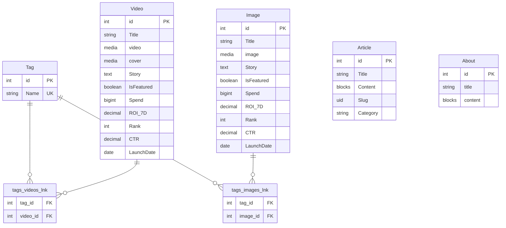

# 数据库表结构 (Database Schema)

> **后端框架**: Strapi v5 (SQLite)
> **生成时间**: 2026-05-29

---

## 目录

- [总览](#总览)
- [表结构详情](#表结构详情)
  - [About (个人简介)](#1-about-个人简介)
  - [Article (文章)](#2-article-文章)
  - [Image (图片作品)](#3-image-图片作品)
  - [Video (视频作品)](#4-video-视频作品)
  - [Tag (标签)](#5-tag-标签)
- [关系图](#关系图)
- [备注](#备注)

---

## 总览

| 表名 | 显示名 | 类型 | 草稿/发布 | 说明 |
|------|--------|------|-----------|------|
| `abouts` | About | collectionType | ✅ | 个人简介模块 |
| `articles` | Article | collectionType | ✅ | 博客文章 |
| `images` | Image | collectionType | ✅ | 图片作品集 |
| `videos` | Video | collectionType | ✅ | 视频作品集 |
| `tags` | Tag | collectionType | ❌ | 作品标签（无草稿机制） |

---

## 表结构详情

### 1. About (个人简介)

> 集合名: `abouts` · 描述: 个人简介模块配置

| 字段名 | 类型 | 必填 | 默认值 | 说明 |
|--------|------|------|--------|------|
| `id` | Integer | ✅ | auto | 主键 (Strapi 自动生成) |
| `title` | String | ✅ | - | 标题 |
| `content` | Blocks | ✅ | - | 富文本内容 (Strapi Blocks 编辑器) |
| `createdAt` | DateTime | ✅ | auto | 创建时间 |
| `updatedAt` | DateTime | ✅ | auto | 更新时间 |
| `publishedAt` | DateTime | - | null | 发布时间 (草稿/发布) |

---

### 2. Article (文章)

> 集合名: `articles` · 描述: 博客文章

| 字段名 | 类型 | 必填 | 默认值 | 说明 |
|--------|------|------|--------|------|
| `id` | Integer | ✅ | auto | 主键 |
| `Title` | String | - | - | 文章标题 |
| `Content` | Blocks | - | - | 文章内容 (Strapi Blocks 编辑器) |
| `Slug` | UID | - | - | URL 标识符 (基于 `Title` 自动生成) |
| `Category` | String | - | - | 分类 |
| `createdAt` | DateTime | ✅ | auto | 创建时间 |
| `updatedAt` | DateTime | ✅ | auto | 更新时间 |
| `publishedAt` | DateTime | - | null | 发布时间 |

---

### 3. Image (图片作品)

> 集合名: `images` · 描述: Image works

| 字段名 | 类型 | 必填 | 默认值 | 说明 |
|--------|------|------|--------|------|
| `id` | Integer | ✅ | auto | 主键 |
| `Title` | String | ✅ | - | 作品标题 |
| `image` | Media (images) | ✅ | - | 图片文件 (单张) |
| `Story` | Text | - | - | 作品故事/描述 |
| `IsFeatured` | Boolean | - | `false` | 是否精选 |
| `Spend` | BigInteger | - | - | 花费金额 |
| `ROI_7D` | Decimal | - | - | 7 日投资回报率 |
| `Rank` | Integer | - | `0` | 排序权重 |
| `CTR` | Decimal | - | - | 点击率 |
| `LaunchDate` | Date | - | - | 发布日期 |
| `tags` | Relation | - | - | 关联标签 (多对多 → Tag) |
| `createdAt` | DateTime | ✅ | auto | 创建时间 |
| `updatedAt` | DateTime | ✅ | auto | 更新时间 |
| `publishedAt` | DateTime | - | null | 发布时间 |

---

### 4. Video (视频作品)

> 集合名: `videos` · 描述: Video works

| 字段名 | 类型 | 必填 | 默认值 | 说明 |
|--------|------|------|--------|------|
| `id` | Integer | ✅ | auto | 主键 |
| `Title` | String | ✅ | - | 作品标题 |
| `video` | Media (videos) | ✅ | - | 视频文件 (单个) |
| `cover` | Media (images) | - | - | 视频封面图 (单张) |
| `Story` | Text | - | - | 作品故事/描述 |
| `IsFeatured` | Boolean | - | `false` | 是否精选 |
| `Spend` | BigInteger | - | - | 花费金额 |
| `ROI_7D` | Decimal | - | - | 7 日投资回报率 |
| `Rank` | Integer | - | `0` | 排序权重 |
| `CTR` | Decimal | - | - | 点击率 |
| `LaunchDate` | Date | - | - | 发布日期 |
| `tags` | Relation | - | - | 关联标签 (多对多 → Tag) |
| `createdAt` | DateTime | ✅ | auto | 创建时间 |
| `updatedAt` | DateTime | ✅ | auto | 更新时间 |
| `publishedAt` | DateTime | - | null | 发布时间 |

---

### 5. Tag (标签)

> 集合名: `tags` · 描述: Tags for portfolio works · ⚠️ 无草稿/发布机制

| 字段名 | 类型 | 必填 | 唯一 | 说明 |
|--------|------|------|------|------|
| `id` | Integer | ✅ | ✅ | 主键 |
| `Name` | String | ✅ | ✅ | 标签名称 |
| `videos` | Relation | - | - | 关联视频 (多对多 → Video，关系拥有方) |
| `images` | Relation | - | - | 关联图片 (多对多 → Image，关系拥有方) |
| `createdAt` | DateTime | ✅ | - | 创建时间 |
| `updatedAt` | DateTime | ✅ | - | 更新时间 |

---

## 关系图

---

## 备注

> [!IMPORTANT]
> ### 字段命名不一致
> `About` 表使用小写字段名（`title`, `content`），其余所有表均使用 PascalCase（`Title`, `Content`, `Story`）。前端查询时请注意大小写。

> [!WARNING]
> ### 残留类型定义
> 生成的类型文件 `types/generated/contentTypes.d.ts` 中包含一个 `ApiWorkWork` 类型，但对应的 `schema.json` 已不存在。这是一个已删除的旧内容类型（曾用单一表管理 video/image，后拆分为独立的 Video 和 Image 表）。建议重新生成类型文件以清理。

> [!NOTE]
> ### Image 与 Video 结构对比
> 两者共享几乎完全相同的业务字段（Title, Story, IsFeatured, Spend, ROI_7D, Rank, CTR, LaunchDate, tags），唯一区别在于媒体字段：
> - **Image**: 仅 `image`（图片，必填）
> - **Video**: `video`（视频，必填）+ `cover`（封面图，可选）

> [!NOTE]
> ### 关系拥有方
> 在 Tag ↔ Image / Tag ↔ Video 的多对多关系中，**Tag 是关系拥有方**（`inversedBy`），Image 和 Video 是被映射方（`mappedBy`）。Strapi 中间表由 Tag 侧管理。
