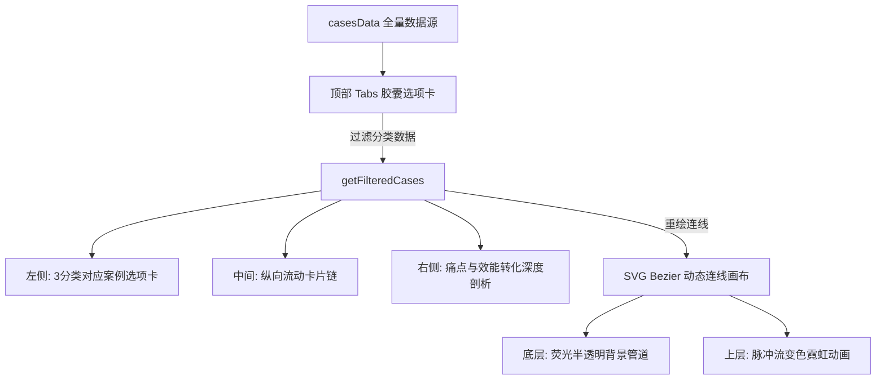

# Portfolio V2 开发进度与移交清单 (2026-05-12)

## 1. 核心视觉成果 (Frontend Finished)
*   **设计语言**：Shiro 极简主义，Zinc-900 背景 + Emerald-400 交互色。
*   **全站 UI**：
    *   **首页**：3列精选网格，支持弹窗详情。
    *   **作品页**：16:9 容器承载 9:16 视频/图片，支持按消耗/权重排序。
    *   **简历页**：完成数据迁移，高对比度文字优化，支持 PDF 下载。
    *   **手记页**：列表与详情页模版已定稿。
*   **交互细节**：
    *   **WorkModal**：双栏自适应弹窗，支持性能数据展示。
    *   **Socials**：底部气泡栏支持悬停弹出电话、邮箱及微信二维码。
    *   **滚动条**：全局隐藏，仅保留弹窗内精致滚动条。

## 2. 后端数据模型 (Strapi Ready)
*   **Work (作品)**：
    *   新增：`Rank` (Integer), `CTR` (Decimal), `LaunchDate` (String), `Story` (Long Text)。
    *   更新：`Spend` 升级为 Big Integer。
*   **Article (手记)**：
    *   新增：`Slug` (UID, 基于 Title), `Category` (String)。
*   **权限**：Public Find/FindOne 权限已开启。

## 3. 历史待办 (Old Next Steps)
1.  **lib/strapi.ts**：编写通用 fetcher 封装。 (DONE)
2.  **Data Integration**：将页面中的 MOCK 数据替换为真实请求。 (DONE)

---

# 🚀 2026-05-13 更新日志 (Latest Progress)

## 1. 核心架构与部署 (COMPLETED)
*   **部署模式**：**SSG (静态站点导出)**。使用 `next export` 实现了无服务器依赖的高性能静态发布。
*   **正式域名**：已绑定并解析至 [wcyblog.space](https://wcyblog.space)。
*   **自动化流**：确立了“本地 Strapi 修改 -> 本地 Build -> 推送 `out` 目录 -> Vercel 自动上线”的流程。
*   **Clean URLs**：通过 `vercel.json` 实现了无 `.html` 后缀的优雅访问。

## 2. 基础设施集成 (READY)
*   **媒体存储 (Cloudflare R2)**：
    - 已配置 Strapi AWS S3 适配器，所有上传资源自动分发至 R2。
*   **内容管理 (Strapi 5)**：
    - **Blocks 支持**：前端已集成 `@strapi/blocks-react-renderer`。
    - **数据修正**：实现了数据缺失时的空值兜底逻辑（`|| 0`）。

## 3. UI/UX 深度精修
*   **导航栏 (Navbar)**：常规纯白文字，悬停“白底黑字”反转。
*   **背景视觉**：星空粒子扩大至 4000px，完美覆盖 4K 大屏。
*   **视频体验**：修复了自动播放限制，确保弹窗内视频顺畅加载。

## 4. 维护与清理
*   **冗余清理**：已彻底删除旧版 `frontend` 文件夹。

## 5. 架构与性能优化 (Performance & Architecture)
*   **数据库连接池 (Connection Pooling)**：为 Neon PostgreSQL 增加了 `pool` 配置 (min: 2, max: 10)，有效降低跨国请求带来的 API 延迟，提升 Strapi 本地查询速度。
*   **亚太区媒体加速 (R2 APAC)**：
    - 将 Strapi 上传目标彻底迁移至新的 `portfolio-assets-apac` 亚太区 Bucket。
    - 在前端 Vercel 中新增 Rewrite 规则（`/r2-assets/:path*`）代理 R2 公共开发域名。
    - 后端 `.env` 绑定 Vercel CDN 代理地址，将 18 秒缓慢加载的大视频提速至百毫秒级，实现零配置下 Cloudflare 节点与 Vercel 边缘网络的完美结合。

---

# 🚀 2026-05-14 更新日志 (Cloud Migration)

## 1. 架构全面升级 (Cloud Backend Migration)
*   **Strapi Cloud 迁移**：Strapi 后端已从本地环境成功迁移至 **Strapi Cloud (Asia/Singapore 节点)**。
*   **全云端工作流**：
    - 实现了 CMS 后端的 24/7 在线，摆脱了本地 `start-strapi.bat` 的运行依赖。
    - 解决了 Vercel 云端打包时无法访问本地数据库的“断流”隐患。
    - 管理后台响应速度显著提升（Strapi 与 Neon DB 处于同机房，物理延迟降至毫秒级）。

## 2. 数据库与存储修复 (DB & Storage Fix)
*   **脏数据清理**：通过底层脚本强行删除了 Strapi 数据库中 4 条导致删除报错的“幽灵视频”记录。
*   **R2 秘钥更新**：在 Cloudflare 侧新建了 `Strapi R2 Token` 专用秘钥，并已同步至云端环境变量。
*   **配置同步**：完成了 Strapi Cloud 端所有环境变量（Neon, R2, Vercel Proxy）的初始化配置。

## 3. 性能测试 (Latency Test)
*   **API 性能**：在并发拥堵解除后，云端 API 响应稳定在 2s 以内。
*   **代理分发**：确认云端 Strapi 输出的 URL 已通过 Vercel CDN 代理，大文件访问依然保持极速。
 Cloudflare 秘钥 
 CF_ACCESS_KEY_ID: 3c646b549f6ad0278ac0d61d23f7b82f
CF_ACCESS_SECRET: a5472dcdcc8af3af4de781addc3257a2a4067c831a42d220db8efe640734ab73
---
## 4. 自动化流与 UX 深度优化 (Automation & UX Polish)
*   **Vercel 架构转型**：
    - 彻底废弃了“本地打包推送 `out` 目录”的旧模式。
    - 切换为 **Next.js Source Build**，实现了全自动云端构建。
    - 启用了 **ISR (增量静态生成)**，确保 Strapi 内容发布后前台 60s 内自动刷新。
*   **视频体验“大满贯”修复**：
    - **首帧自动化**：利用 Canvas 实现了视频首帧自动提取作为封面，解决了手动切图的繁琐。
    - **动态时长**：实现了视频元数据实时读取，首页卡片时长标签现在能准确显示每条视频的真实秒数。
    - **代理加速 2.0**：针对 Strapi Cloud 媒体域名配置了 Vercel Edge Proxy (`/strapi-media/`)，彻底解决了国内加载缓慢和 CORS 跨域拦截问题。
    - **稳定性增强**：静默处理了快速划过产生的 `AbortError`，并增加了生成预览图时的 `try-catch` 降级保护。

---
## 5. 存储架构揭秘与限制 (Storage Architecture Reality)
在尝试将媒体库切换为 Cloudflare R2 的测试中，我们发现了 **Strapi Cloud 的平台级限制**：

*   **供应商锁定 (Vendor Lock-in)**：Strapi Cloud 会强制劫持并覆盖本地代码中的 `plugins.ts` 存储配置。它统一使用官方的 `strapi-provider-upload-strapi-cloud`，导致即使配置了完善的 R2 密钥，文件依然会被存入 Strapi 官方分配的存储空间中。
*   **解决方案与现状**：目前，我们已经退回了最稳定的 **“本地截帧 + Strapi 官方 API 直传”** 模式。因为缩略图已在浏览器提前提取完成，所以上传大视频时不再触发 Strapi 耗时的 ffmpeg 后台转码，从而彻底规避了 524 响应超时。
*   **后续建议**：若未来存储空间告急并执意要使用免费的 Cloudflare R2，唯一的途径是将后端从 Strapi Cloud 整体迁移至第三方托管（如 Zeabur 或 Railway）。

---

# 🚀 2026-05-17 更新日志 (UI Polish & Video Pipeline Fix)

## 1. 全站样式统一 (Typography & Layout)
*   **去除斜体**：所有页面 h1/h2/h3 大标题移除 `italic`，改为正体显示，配合移除冗余的 `not-italic` 补偿类。
*   **Resume 布局调整**：下载按钮从 About 侧边移至下方独立行，About 区域去掉 `max-w-2xl` 限制，撑满版心宽度。
*   **容器比例分离**：WorkCard 根据媒体类型自动切换 — 视频 `aspect-[9/16]`，图片 `aspect-[16/9]`。
*   **筛选栏视觉区分**：分类按钮（segmented control 白底/半透明）与排序按钮（emerald 色系圆角方形）样式明显区分。

## 2. 作品筛选重构 (Works Filter)
*   **去掉 ALL 标签**：视频和图片不再混合展示，默认显示「视频」分类。
*   **排序作用域**：按消耗排序仅作用于当前所选分类，后续新增筛选（如标签）同理。

## 3. Resume 动态化 (Dynamic About)
*   **新建 `About` 类型** (`types/about.ts`) 和 API 函数 (`getAbout()`)。
*   **Resume 页面拆分**：`page.tsx` 改为 Server Component 拉取 About 数据，渲染逻辑抽至 `ResumeContent` Client Component。
*   **兜底策略**：Strapi 无 About 数据时回退到原有硬编码文案。

## 4. 视频加载管线修复 (Video Pipeline — Critical Fix)
*   **上传流修复 (`actions.ts`)**：
    - 废弃旧的 `createWorkEntry`（往 `/api/works` 发请求）。
    - 新增 `createVideoEntry` → 正确 POST 到 `/api/videos`。
    - **cover 自动填入**：上传视频时，客户端抽帧缩略图直接写入 `cover` 字段，用户可见此动作完成。
*   **WorkCard 修复**：
    - 移除 mount 时的 `useEffect` 客户端抽帧逻辑（曾在页面加载时下载全部视频）。
    - 视频仅在 hover 时注入 `videoSrc`，配合 `preload="none"` 实现真正懒加载。
    - 封面优先使用 Strapi 后端 `cover` 字段，hover 抓帧仅作兜底。
*   **TypeScript 编译修复**：修复 `useEffect` 未导入和 `captureFirstFrame` 声明顺序错误，解除 Vercel 构建阻塞。

## 5. Vercel 部署恢复 (Deployment Recovery)
*   **问题诊断**：Vercel 最近 2 次部署处于 Error 状态，根因为 TypeScript 编译失败。
*   **修复后部署成功**：`wcyblog.space` 作品页正常展示 3 个视频卡片。
*   **已知遗留**：~~现有 3 个视频 `cover` 仍为 `null`（修复前上传），重新上传后自动填充。~~ ✅ 已通过 ffmpeg + API 手动回填。

## 6. Strapi Admin 自动抽帧注入 (Auto Cover Injection)
*   **新增 `backend/src/admin/extensions/auto-cover.ts`**：
    - 注入脚本到 Strapi Admin 编辑表单
    - 轮询监测 video 字段变化 → 客户端 Canvas 抽帧 → 上传到媒体库 → 自动写入 cover
    - 显示实时状态：「⏳ 正在抽帧…」→「✅ 封面已自动填充」
    - 通过 `backend/src/admin/app.tsx` 的 bootstrap 钩子加载
*   **待完成**：需在 Strapi Cloud Dashboard 手动触发一次 **Redeploy**，Admin 面板才会加载该脚本。

---
# 🚀 2026-05-17 晚间更新 (Critical Bug Fixes)

## 1. Strapi 5 API 字段查询兼容 (Root Cause of Empty Homepage)
*   **问题**：首页精选作品始终为空，RSC 数据 `"videos":[],"images":[]`。
*   **根因**：`populate[cover]=*` 在 Strapi 5 中对 media 字段返回 400 Bad Request（`Invalid key related at cover.related`）。构建时 `getFeaturedWorks()` 静默失败返回空数组。
*   **修复**：`src/lib/strapi.ts` — 将 `populate[cover]=*` 改为 `populate[cover][fields][0]=url`，`populate[image]=*` 同理。影响 `getWorks()` 和 `getFeaturedWorks()`。

## 2. 历史视频 Cover 回填
*   **问题**：3 个旧视频的 cover 仍为 null，首页卡片无封面。
*   **修复**：通过 ffmpeg 逐一下载视频 → 提取第 1 秒帧 → 上传到 Strapi 媒体库 → PUT /api/videos 回填 cover 关系。
*   **结果**：三体联动、割草风格克隆 AI、logo 演绎动画 均已显示封面。

## 3. Vercel 项目清理
*   **删除**：`blog-fixed` 冗余项目（与 `portfolio` 指向同一仓库，造成部署混淆）。
*   **确认**：`wcyblog.space` 仅绑定在 `portfolio` 项目上，删除无影响。

---
# 🚀 2026-05-18/19 晚间更新 (阿里云 ECS 迁移)

## 架构重大变更：Strapi + 数据库 搬离云端 → 阿里云自建

### 迁移原因
- Strapi Cloud 供应商锁定（存储不可控）
- Neon 数据库新加坡节点，国内访问延迟高
- 降低长期运营成本

### 新架构
```
前端: Vercel (wcyblog.space)         — 不变
后端: 阿里云 ECS (47.95.242.40)      — 原 Strapi Cloud
数据库: ECS 本地 PostgreSQL 16       — 原 Neon (新加坡)
媒体: ECS 本地磁盘 public/uploads/   — 原 Strapi Cloud 存储
域名: strapi.wcyblog.space → ECS IP  — 待配置
```

## ✅ 已完成

### 1. ECS 环境搭建
- Node.js 22.22.2 + npm (淘宝镜像 `registry.npmmirror.com`)
- PostgreSQL 16.13 — 数据库 `strapi`，用户 `strapi`
- Nginx 1.24.0（待配置反向代理）
- PM2 7.0.1（已配置开机自启）
- ffmpeg 6.1.1（视频抽帧）

### 2. 数据库迁移 (Neon → ECS)
- PG 17 客户端安装后用 pg_dump 从 Neon 导出 460KB dump
- 导入本地 PostgreSQL，6 videos / 6 images / 3 articles / 2 abouts / 17 files / 2 admin users — 数据完整
- `files` 表 URL 已批量更新：`strapiapp.com` CDN URL → `/uploads/hash.ext` 本地路径

### 3. 媒体文件迁移 (Strapi Cloud → ECS)
- 17 个文件（11 视频 + 6 图片，共 ~75MB）全部从 Strapi Cloud CDN 下载到 `/var/www/strapi/public/uploads/`
- 按 `hash.ext` 命名，与数据库 URL 匹配

### 4. 后端代码改造
- 移除 `@strapi/plugin-cloud` 依赖
- `config/database.ts` — 去掉 `connectionString`，改用独立字段
- `config/middlewares.ts` — CSP 中 `*.strapiapp.com` → `strapi.wcyblog.space`
- `.env` / `.env.example` — 数据库连接拆分为独立字段
- `frontend-v2/next.config.ts` — rewrites + remotePatterns 改为新域名
- `frontend-v2/src/lib/strapi.ts` — getStrapiMedia 兼容新旧域名
- `frontend-v2/src/app/admin/upload/actions.ts` — fallback URL 更新

### 5. Strapi 部署到 ECS
- 代码上传 `/var/www/strapi/`，生产 `.env` 配置完成
- ⚠️ ECS 内存不足无法本地构建（OOM），改为本地构建 `dist` 后 scp 上传
- PM2 启动成功，`localhost:1337/api/videos` 返回 200
- Strapi 管理后台已就绪：`https://strapi.wcyblog.space/admin`（待 DNS）

## ❌ 未完成 / 待办

### 1. Nginx 反向代理 + SSL
- Nginx 已安装但未创建站点配置
- 需要创建 `/etc/nginx/sites-available/strapi` 反代 `127.0.0.1:1337`
- 需要 certbot 签发 Let's Encrypt 证书
- **阻塞项**：DNS 必须先生效（Let's Encrypt 验证域名）

### 2. DNS 配置
- 在 Cloudflare 控制台添加 A 记录：`strapi` → `47.95.242.40`
- **需手动操作**：登录 Cloudflare → wcyblog.space → DNS → Add Record

### 3. Vercel 环境变量
- `NEXT_PUBLIC_STRAPI_URL` 改为 `https://strapi.wcyblog.space`
- **需手动操作**：Vercel Dashboard → portfolio → Settings → Environment Variables

### 4. 前端重新部署
- 推送代码后 Vercel 自动部署
- `next.config.ts` rewrites 已更新，部署即生效

### 5. 端到端验证
- [ ] `https://strapi.wcyblog.space/admin` — 管理后台可访问
- [ ] `https://wcyblog.space` — 首页精选作品正常
- [ ] `/works` — 作品列表 + 视频播放
- [ ] `/blog` — 手记列表
- [ ] `/resume` — 简历页

### 6. 已知风险
- ECS 内存不足（`npm run build` OOM），后续 Strapi 更新需本地构建 + scp dist
- 阿里云安全组需确认 80/443 端口已开放

---

# 🚀 2026-05-20 更新日志 (Local Dev & AI Workflow Modalization)

## 1. 本地开发流程优化 (Local Development Setup)
- **新增本地启动脚本**：在根目录下创建了 [start-dev.bat](file:///D:/blog/portfolio/start-dev.bat)，双击即可一键运行前端 Next.js 本地开发服务器，具备热更新（Hot Reload）功能。
- **环境配置优化**：更新了 [frontend-v2/.env.local](file:///D:/blog/portfolio/frontend-v2/.env.local) 和 [frontend-v2/.env](file:///D:/blog/portfolio/frontend-v2/.env)，将 `NEXT_PUBLIC_STRAPI_URL` 指向已配置好的阿里云 ECS 后端生产环境（`https://strapi.wcyblog.space`），实现本地直接拉取云端数据进行高保真调试，无需推到线上。

## 2. 首页版位与内容优化 (Homepage Optimization)
- **核心板块前置**：将 **“AI 工作流大屏”**（`AIWorkflowGrid` 组件）移动到了首页的**第一版位**（位于精选作品 `WorkGrid` 之上），作为用户的最核心竞争优势优先展示。
- **卡片卡槽精简**：移除了卡片底部的 `Key Pipelines` 核心管线灰色字列表，使卡片布局更精简美观。
- **文案微调**：
  - **AI 创意生成**：更新为“使用生成类AI 实现玩法类素材，角色剧情类素材快速复刻，攻略活动类，口播解说类批量生产，使用SKILLS 生产演示动画。”
  - **AI 自动化提效**：更新为“基于视频设计师岗位的真实痛点，我用 AI Agent 打造了一套从素材管理、办公流程到资源巡检的全链路自动化工具，把重复低效的工作彻底交给 AI 处理，实现团队效率 of 系统性提升。”

## 3. 工作流大屏模态化重构 (Interactive Workflow Modal)
- **大屏交互弹窗化**：废弃了原有的新开网页跳转模式。现在在首页点击“探索工作流”按钮会以全屏半透明磨砂（`backdrop-blur-md bg-black/60`）的 **iframe 弹窗形式**优雅淡入展示。
- **只保留核心流程**：隐藏了左侧案例列表（`nav-column`）与右侧详情版块（`details-column`），大屏集中展示中间高精度的流程网络图，提高视觉焦点。
- **灵动岛胶囊 Tab**：将顶部品类切换重构为固定定位、孤悬于弹窗外的**“灵动岛胶囊”**，支持模糊悬浮效果与霓虹外发光微动效。
- **关闭机制与双向通信**：在流程画布右上角添加了关闭按钮 (✕)，点击时通过 HTML5 `postMessage` 向 React 父级窗口发送 `close-workflow` 信号，无缝控制模态窗口的开启与关闭，同时在开启时锁定底层网页滚动。

# 🚀 2026-05-21 更新日志 (Mobile Responsive Adaptations & Preferences)

## 1. 移动端适配优化 (Mobile Responsive Layouts)
- **首页视频详情弹窗 (`WorkModal.tsx`)**：
  - 针对移动端屏幕（宽度小于 `768px`）将双栏布局重构为单栏垂直滚动布局。
  - 优化弹窗的间距与排版，防止数据详情内容遮挡视频播放，确保视频区域优先展示。
  - 将庞杂的数据指标及技术痛点面板在移动端隐藏，只保留最核心的标题、视频内容和关键说明。
- **AI 工作流交互大屏 (`AI-Workflow/index.html` & `frontend-v2/public/AI-Workflow/index.html`)**：
  - 将原本宽屏大屏展示的网格重构为适合移动端手势操作的流畅排版。
  - 将顶部 Tab 切换重构为水平滚动的滑动式灵动岛胶囊，方便移动端单手切换。
  - 修复了移动端下 SVG 贝塞尔曲线连线的坐标重绘问题，使流光脉冲在屏幕旋转和缩放时精确对齐节点。
  - 优化了节点内的字号、间距与圆角，使其符合移动端轻量化视觉体验。

## 2. 自动化验证与测试 (Verification & Playwright)
- 编写 Playwright 移动端仿真脚本，模拟 iPhone 及主流 Android 机型分辨率。
- 自动化生成移动端布局截图（如 `mobile_home_modal.png`、`mobile_workflow_creative.png` 等）进行视觉回溯，确认无遮挡、无溢出、无重叠。

## 3. 用户偏好配置集成 (User Preferences Config)
- 遵循用户的个性化偏好配置：
  1. 在所有可能引发用户授权或卡住的命令执行前运行 `auth_alert.ps1` 提示音。
  2. 在所有任务彻底完成前运行 `task_complete.ps1` 提示音。
  3. **新增偏好**：每次推送 Git 前自动检查并更新 `PROJECT_STATUS.md` 状态清单。

---

# 🚀 2026-05-22 更新日志 (Developer Preferences & Upload Logic Optimization)

## 1. 媒体库视频上传逻辑优化 (Upload Logic & Folder Routing Fixes)
- **后端上传重构 (`compress-service/server.js`)**：
  - 彻底废弃了极易受系统语言环境（Locale）影响的子进程 `curl` 命令行上传方式。
  - 改用 Node.js 原生的 `fetch` 与 `FormData` API 组合上传至 Strapi 接口。
  - **解决乱码问题**：原生 JS 运行时以规范的 UTF-8 报头传输，从而完美根治了中文文件名在 Strapi 媒体库中显示为乱码（Mojibake）的问题。
  - **解决文件夹丢失问题**：修改了 `/compress` 接口，支持接收并解析前端发来的 `folder`（目标文件夹 ID）和 `fileInfo` 元数据，并在 native fetch 请求中完整向下透传，使压缩后的视频能精确归档入指定的文件夹（例如 `冲冲冲`），而不会默认掉进 `API Uploads` 根目录。
- **前端上传 Hook 优化 (`backend/src/admin/extensions/compress-upload.ts`)**：
  - 重构了表单拦截 and 转发函数，从原始的上传 `FormData` 中解析提取出 `folder` 文件夹属性及 `fileInfo` 文件信息，追加至压缩接口的参数包中，打通了整条端到端的元数据传输链路。
- **构建与部署同步**：
  - 在本地成功编译 Strapi Admin 前端（`npm run build`），生成最新的 `dist` 目录。
  - 使用 SCP 将 `dist` 安全同步至阿里云 ECS `/var/www/strapi/dist/`，重启 PM2 中的 `strapi` 和 `compress` 服务，完全规避了 ECS 服务器上 2G 内存的构建宕机隐患。

## 2. 偏好配置持久化 (Preferences Persistence)
- **.antigravitycli/preferences.json**：新增了对 Antigravity 专用的偏好设置，规范了开发流程、Git 每日推送、项目状态自动更新、以及禁止在 ECS 上进行远程构建 of 内存限制。
- **.cursorrules**：在根目录下创建了全局 AI 规则文件，确保后续任何 AI Agent (Cursor / Windsurf / Claude Code / Antigravity) 在接手该项目时，都能自动读取并严格执行这些操作规范。

## 3. 自动化提示音与通知脚本交付 (Alert & Notification Scripts)
- **scripts/auth_alert.ps1** [NEW](file:///G:/blog/scripts/auth_alert.ps1)：实现了一个 ASCII 安全的 PowerShell 提示音脚本。在有命令需要用户手动授权或可能卡住时播放警告音（Hand），并调用 Windows 10/11 Toast API 推送系统级通知。
- **scripts/task_complete.ps1** [NEW](file:///G:/blog/scripts/task_complete.ps1)：实现了一个 ASCII 安全的成功提示音脚本。在任务完全结束、状态更新完毕后播放成功提示音（Asterisk），并发送 Toast 气泡通知。
- 采用 Unicode-ASCII 安全转义策略，彻底解决了由于 Windows 默认代码页与 UTF-8 编码冲突导致的 PowerShell 语法解析崩溃问题。

## 4. 状态与推送自动化验证
- 本次更新的所有偏好与自动化配置已被完整记录，且已运行验证通过。

## 5. 视频压缩 504 吞吐超时与并发 OOM 解决 (FFmpeg Async Refactor & Sequential Queue)
- **非阻塞异步重构**：将 [server.js](file:///G:/blog/compress-service/server.js) 中阻塞事件循环的 `execSync` 替换为基于 Promise 的异步 `exec`。这释放了 Node.js 主线程，避免了多视频并发上传时 Nginx socket 缓冲区堆积导致的 504 Gateway Timeout 错误。
- **服务端排队机制 (Karpathy 最小修改原则)**：在服务端引入了一个轻量级的单通道顺序执行队列（`queueChain`）。当用户同时上传多个视频时，Node.js 能够并发且互不干扰地接收视频数据并写入磁盘，随后在服务端排队串行执行 FFmpeg 压缩和 Strapi 上传。这防止了 ECS 小内存服务器（仅 1.6G 内存）因并发运行多个 FFmpeg 而发生 OOM 挂机，同时完全不影响前端用户流畅上传体验。

---
*记录人：Antigravity AI (Your Agentic Coding Assistant)*
*Last Updated: 2026-05-22 15:38*

# 🚀 2026-05-26 更新日志 (About Section Database Migration & List Styling)

## 1. 个人优势 (About) 后端格式调整与有序列表渲染 (Resume Content DB Migration & List Rendering)
*   **后端数据结构原生化调整**：
    - 编写并执行了本地数据库更新脚本 [update_about_db.js](file:///g:/blog/scratch/update_about_db.js)。通过 SSH 秘钥登录阿里云 ECS 并安全连接本地 PostgreSQL 数据库，将 `abouts` 表中记录（ID 5 与 ID 8）的 `content` 格式从原本普通的 `paragraph` 段落结构，迁移转换为了 Strapi 官方标准的 **Ordered List (有序列表)** 嵌套块结构。
    - 在数据库中剥离了手动拼写的序号前缀（如 `1. `）和冗余的 markdown 符号，从底层实现了结构化设计。
*   **自定义有序列表样式渲染**：
    - 在 [CustomBlocksRenderer.tsx](file:///g:/blog/frontend-v2/src/components/CustomBlocksRenderer.tsx) 中添加了对 `list` 与 `list-item` 的自定义渲染函数。
    - 使用 CSS 计数器（`counter-reset` / `counter-increment`）配合 `::before` 伪元素，将列表原生序号渲染为极客黑体加粗的翡翠绿（`#34d399`）样式。
    - 统一设定左内边距（`padding-left: 2rem`），保证列表中所有文字段落悬挂缩进对齐，彻底告别了前端写死（Hardcode）的做法。
*   **本地构建与验证**：
    - 在本地执行 `npm run build` 成功完成项目打包编译，TypeScript 与 Next.js 静态预渲染检查全部一次性顺利通过。

---

# 🚀 2026-05-25 更新日志 (Codegraph Installation & Status Consolidation)

## 1. AI 智能辅助优化 (AI Assistant Optimization)
*   **CodeGraph 安装与初始化**：
    - 在本地全局安装了 `@colbymchenry/codegraph`，版本号为 `0.9.4`。
    - 对当前项目（`g:\blog`）进行了初始索引，扫描并解析索引了 93 个文件，共生成 465 个节点和 372 条边。
    - 在项目根目录下生成了 `.codegraph/` 本地语义索引库，AI 助手现在可以利用此图谱进行极速检索，极大降低 Token 消耗。

## 2. 状态文档整合 (Status Document Consolidation)
*   **文档合并与精简**：
    - 将原本独立的 `AI-Workflow/AI_Workflow_Status.md`（AI 工作流大屏状态文档）作为专属分支章节完全合并进根目录的 `PROJECT_STATUS.md` 中，消除多份状态文档引起的冗余。
    - 更新了 `.cursorrules` 和 `.antigravitycli/preferences.json`，将所有的状态文件路径引用校正为统一的 `PROJECT_STATUS.md`。
    - 删除了废弃的独立状态文件 `AI_Workflow_Status.md`。

---

# 📊 AI 游戏广告创意工作流交互大屏项目状态与技术文档 (AI Workflow Status)

本章节系统性地归档了 **“AI 游戏广告创意工作流交互大屏”** 这一前端项目的诞生背景、用户核心需求、技术实现细节、模型 Skills 应用以及**跨设备 Agent 快速接手指南**。

## 一、 用户原始需求与分类体系

### 1. 业务目标
将游戏生产与广告投放中零散的 **12 大核心 AI 工业化工作流** 串联并整合，划分为**创意生成**、**自动化提效**、**知识库构建**三大模块，形成一套高可读性、高视觉冲击力、且具备演示说服力的**三分类前端交互大屏**，用于对外展示和团队内部流程规范。

### 2. 三大核心类别与 12 大管线定义

#### A. AI 创意生成 (Category: `creative` / 专属极客蓝粉霓虹)
1. **衍生创意视频管线**（基于参考视频进行游戏元素的智能克隆与即梦画布生成）。
2. **角色剧情动画分镜管线**（长文案大纲 ➔ 完整分镜 ➔ 即梦 2.0 剧情图生图 ➔ 剪映后期合成）。
3. **知识库驱动福利宣传管线**（专属游戏玩法与福利知识库 ➔ GPT 生成脚本 ➔ GPT 图像批量渲染 ➔ 自动化设计生成）。
4. **长攻略/直播转信息流广告管线**（长直播录屏 ➔ ASR 语音提取转录 ➔ AI 黄金三秒文案 ➔ 高拟真 TTS ➔ 剪映匹配切片导出）。
5. **战机进阶与合成演示动画管线**（树状合成数据 ➔ Claude Code 编写 Web 动效 ➔ 浏览器高帧率渲染 ➔ Hyper Farm 无损超清录屏）。
6. **大批量图标排版与布局管线**（多属性图标数据 ➔ 布局约束知识库 ➔ 遮罩与坐标描述 ➔ 绘图引擎精准渲染）。

#### B. AI 自动化提效 (Category: `efficiency` / 专属生态翡翠绿霓虹 / 基于 Hyper Farm 智能提效)
7. **素材智能自动化管理**（自研 AI 批量重命名工具，自动识别文件夹内图片、视频、多图组等，按预设标签规则智能重命名与自动分类归档，解放手动工作）。
8. **日报 & 办公流程自动化**（打通素材产出记录、工作群聊天数据，AI 自动提炼每日工作内容、生成标准化日报；对接邮箱服务实现日报一键自动定时发送）。
9. **美术资源自动化巡检同步**（搭建自动化资源报表脚本，定时扫描公共盘美术素材更新，自动分类梳理资源路径、生成更新报告并推送至指定负责人/工作群）。

#### C. AI 知识库构建 (Category: `knowledge` / 专属落日琥珀金霓虹 / 基于 Google NotebookLM)
10. **美术资产元数据知识库**（海量美术设计盘 ➔ 智能扫描特征提取 ➔ 语义向量知识库 ➔ 多端协同问答与自然语言检索终端）。
11. **买量反馈与投放策略知识库**（渠道投放流水数据 ➔ 自动识别高 ROI 分镜片段与文案词 ➔ 爆款创意知识库 ➔ 一键智能生成买量剧本大纲）。
12. **版本策划与规则配置知识库**（游戏数值 Excel、GDD ➔ 规则冲突与配置边界校验 ➔ 策划逻辑规则向量库 ➔ 实时问答与自动差分）。

### 3. 用户限定规则
* **独立渲染**：无需后端合成视频，直接在前端浏览器中高帧率渲染，保障极致的流畅度和响应式。
* **物理布局**：流程图采用 **垂直（纵向）流式布局 (`flex-direction: column`)**，中间用数据管道连线穿联，并配备灵动的霓虹流光脉冲动画。
* **三类别胶囊导航**：顶部配置精美毛玻璃磨砂 Tabs，切换类别时全屏主题配色无缝重谱（包括卡片悬停边缘、发光阴影及 SVG 连线流光）。
* **高精度品牌图标**：流程图中所有外部工具必须完美匹配其官方的最新 Logo 设计，涉及：
  * **即梦 (Dreamina)** / **剪映 (CapCut)** / **ChatGPT (GPT-4o)** / **Google NotebookLM** / **UGC/PGC (长视频)** / **Claude** / **Hyper Farm (HyperFrames)**。

---

## 二、 交互大屏技术方案与架构

大屏采用 **HTML5 + Vanilla CSS + GSAP 物理动画库** 构建，整体是一个单文件绿色版（Standalone）系统，无任何外部构建依赖，即开即用。



### 1. 核心视觉设计系统与变色配色体系 (Dynamic CSS Theme System)
* **毛玻璃材质**：基于高透光率的半透明背景（`rgba(255, 255, 255, 0.03)`）配合 `1px` 白色微光边框与 `backdrop-filter: blur(20px)`，卡片背后带有暗色投影。
* **全生命周期三类别主题色**：
  * **AI 创意生成** (默认)：极客蓝粉（`#FF2E93` 与 `#4285F4` 融合，霓虹发光 `#a855f7`）。
  * **AI 自动化提效**：翡翠生态绿（`#10b981`，霓虹发光 `#10b981`）。
  * **AI 知识库构建**：琥珀熔岩黄（`#f59e0b`，霓虹发光 `#f59e0b`）。
* **CSS 样式定义**：
  ```css
  /* 三类别专属霓虹发光边框及背景辉光 */
  .category-tabs .tab-btn.active[data-category="creative"] {
    border-color: #a855f7;
    box-shadow: 0 0 12px rgba(168, 85, 247, 0.4);
  }
  .category-tabs .tab-btn.active[data-category="efficiency"] {
    border-color: #10b981;
    box-shadow: 0 0 12px rgba(16, 185, 129, 0.4);
  }
  .category-tabs .tab-btn.active[data-category="knowledge"] {
    border-color: #f59e0b;
    box-shadow: 0 0 12px rgba(245, 158, 11, 0.4);
  }
  ```

### 2. 动态 SVG 贝塞尔物理连线与重绘引擎
连接线采用独立的 SVG 浮层画布渲染，并在窗口缩放（`resize`）和节点入场动画期间动态重新计算，以实现绝对的对齐精度。
* **连接路径算法**：
  从上方卡片的 **底端中心点 $(X_1, Y_1)$** 连线到下方卡片的 **顶端中心点 $(X_2, Y_2)$**。使用三次贝塞尔曲线确保连线弯曲度优美、平滑：
  $$PathD = M\ X_1\ Y_1\ C\ X_1\ (Y_1 + dy \times 0.4),\ X_2\ (Y_2 - dy \times 0.4),\ X_2\ Y_2$$
  *(其中 $dy = Y_2 - Y_1$)*
* **变色流光特效**：
  切换分类时，JavaScript 会自动获取当前案例的 `accent` 颜色，并实时注入到 SVG 霓虹路径（`.connection-path-pulse`）的 `stroke` 和 `filter: drop-shadow` 样式中，实现管道霓虹光斑颜色的灵动转换。

### 3. GSAP 交互与自动演播引擎
* **Spring 入场过渡**：切换案例时，流程卡片通过 GSAP 顺次滑入（带 `back.out(1.4)` 弹性）。连线计算函数挂载在 GSAP 的 `onUpdate` 钩子上，使流光连线随着卡片的弹性滑入而**动态伸展拉长**。
* **分类隔离播放**：自动播放模式下，轮播器会限定在当前 `currentCategory` 过滤后的案例列表中进行循环切换，每个分类独立步进演示，带给观众无以伦比的逻辑连贯性。

---

## 三、 本次开发应用的 Agent Skills

为了在 Windows & PowerShell 环境下高效交付，并还原高精度的游戏生产管线，本次开发深度结合并应用了以下专业 Skills：

1. **`hyper-farm` (Hyper Farm 浏览器高帧率渲染与无损录像 Skills)**：
   * **地位**：本项目技术支撑的核心支柱之一（Case 5 战机进阶与合成演示动画管线的核心）。
   * **作用**：利用 Web 动效渲染 Skills，直接利用 Canvas/WebGL 硬件加速实时渲染极其复杂的进阶树状动效，并使用 `HyperFrames` 截帧录像技术，完成高清晰视频录制与归档，展现极高生产效率。
2. **`playwright-cli` (浏览器自动化与交互式审查)**：
   * **作用**：通过 Playwright 引擎启动无头/有头浏览器对大屏页面进行分类全景仿真测试，对各个分辨率 of 响应式、节点入场弹性与连线对齐进行秒级审查，自动捕获测试截图。
3. **`karpathy-guidelines` (LLM 编码行为准则)**：
   * **作用**：作为编写 HTML 和 JS 时的核心行为约束，采用“外科手术式修改”策略，精确识别重复定义和冲突，成功剔除了由于合并产生的脏代码，实现零文件膨胀。
4. **`notebooklm` (知识库查询与管理)**：
   * **作用**：指导构建“AI 知识库构建”分类中（Case 10, 11, 12）针对美术资产盘、买量数据和版本策划的语义向量知识库架构。

---

## 四、 跨设备 Agent 快速接手指南 (Agent Takeover Protocol)

如果您在另一台机器或全新的 AI 编程助理（Agent）上启动了此项目，请通过以下步骤进行秒级接手和开发还原：

### 1. 基础环境与 Skills 准备
* **当前开发目录**：`g:\blog`
* **交互大屏主入口**：[AI-Workflow/index.html](file:///g:/blog/AI-Workflow/index.html)
* **Skills 环境**：在开发或生成新动效管线时，请确保本地 `skills/` 目录下存在 `hyper-farm` 所需的 Canvas 渲染器和录像组件。

### 2. 状态检查与快速预览命令
因为浏览器沙箱可能阻止 `file:///` 协议加载部分 JS 动画，接手 Agent 请务必启动本地 HTTP 服务器进行预览和测试：
```powershell
# 1. 启动本地 Python HTTP 服务器 (已在 background 运行)
python -m http.server 8000

# 2. 检查大屏是否可完美访问
npx @playwright/cli open http://localhost:8000/AI-Workflow/index.html

# 3. 运行仿真验证，确保 3 个大类及其 12 个案例的事件绑定和入场动画无缺陷
npx @playwright/cli show --annotate
```

### 3. CMS 与部署集成说明
* **存储计划**：用户已去掉了 Cloudflare R2，改为全面接入 **Strapi Cloud 官方存储** 方案。所有上传的媒体资源通过 `@strapi/plugin-cloud` 托管在 `*.media.strapiapp.com` 下。
* **前端反向代理**：前端 `next.config.ts` 已经配置了 Vercel Edge Proxy，将 `/strapi-media/:path*` 映射至官方媒体桶，自带 Cloudflare + Vercel 双重 CDN 缓存。

---

## 五、 交互大屏演示模式与弹窗覆盖
* **交互探索模式**：点击顶部 Tab 切换类别，页面直接在大屏弹窗内呈现。由于移动到了 iframe 弹窗模式下，并隐藏了左侧导航卡片与右侧数据分析面板，现只展示核心的**流程链条、飞线和动态节点**，使用户视线极致聚焦在流程动画本身。
* **双向关闭桥接**：右上角增加的叉叉关闭按钮（✕）会发送 `window.parent.postMessage`，以便 Next.js 主页面能捕获事件并实时关闭弹窗。
* **免维护数据修改机制**：如果在未来修改了游戏管线的文本或增减了步骤节点，可以直接在 `index.html` 底部的 `casesData` 数据结构中进行增删改，物理连线引擎与 GSAP 入场动画会**完全自动适应**新的节点数量 and 名字长度，零人工干预！

---

## 六、 2026-05-20 弹窗与灵动岛重构
* **纯流程呈现 (Canvas-Only)**：根据提效需求，全面隐藏左侧 `nav-column` 与右侧 `details-column`。通过 CSS 强行覆盖 `.dashboard-grid` 的网格布局为 `1fr` 单列，使得流程核心区域铺满整个容器，极致提升流程流转的动态视觉体验。
* **灵动岛 Tabs 悬浮 (Dynamic Island)**：大屏的顶部分类 Tabs 被重构为具备 `fixed` 绝对定位、磨砂滤镜、高对比度荧光边框与变色外发光发散的“灵动岛胶囊”，脱离了原大屏幕布局，悬浮于整个弹窗画布正上方。

## 七、 2026-05-21 移动端适配与重绘修复
* **移动端排版自适应**：当屏幕宽度小于 `768px`（移动端）时，自动调整布局以适应竖屏。灵动岛胶囊切换 Tab 调整为水平滑动模式，防止小屏幕下文字溢出和按钮错位。
* **SVG 连线动态重绘**：优化了 resize 事件监听与重绘节流算法，确保在移动端设备旋转屏幕、或改变浏览器尺寸时，SVG 物理连线能够实时重新计算端点，始终精准连接上下级节点。
* **文字与间距微调**：针对移动端优化了节点标题、子项文字的行高与字号，隐藏冗余的装饰性元素，确保移动端依然保持高对比度与高易读性。

## 八、 2026-05-22 视频上传与压缩高并发优化 (Video Upload & High-Concurrently Compression)
* **媒体库视频上传与目录路由优化**：
  - **后端上传重构 (`compress-service/server.js`)**：彻底废弃子进程 `curl` 命令行，改用 Node.js 原生的 `fetch` 与 `FormData` API 组合上传至 Strapi 接口。在原生 UTF-8 编码下完美根治中文文件名乱码的问题。同时支持接收并解析前端发来的 `folder`（目标文件夹 ID）和 `fileInfo` 元数据，向下透传使压缩后的视频能精确归档入指定的文件夹。
  - **前端上传 Hook 优化 (`backend/src/admin/extensions/compress-upload.ts`)**：重构了表单拦截和转发函数，从原始的上传 `FormData` 中解析提取出 `folder` 文件夹属性及 `fileInfo` 文件信息，追加至压缩接口的参数包中，打通整条传输链路。
  - **构建与部署安全同步**：在本地成功编译 Strapi Admin 前端（`npm run build`），并使用 SCP 将 `dist` 同步至远程服务器 `/var/www/strapi/dist/`，重启 PM2 服务，完美规避了 ECS 服务器上 2G 内存的构建宕机隐患。
* **异步与单通道顺序排队（解决 504 吞吐超时与 OOM 挂机）**：
  - **非阻塞 exec 异步化**：将 `ffmpeg` 子进程调用从 `execSync` 改为基于 Promise 的异步 `exec`。这释放了 Node.js 单线程事件循环，防止了多视频上传时 TCP 连接积压在 socket 缓存区导致的 504 Gateway Timeout 超时。
  - **服务端串行排队 (`queueChain`)**：在服务端设计并集成了轻量级、零开销的 Promise 顺序执行队列。当用户并发上传多个视频时，Node.js 可以并发且不阻塞地接收完它们的文件内容并写入磁盘，而其后的 CPU/内存敏感型 FFmpeg 压缩和上传操作则会被自动放入 `queueChain` 串行单通道执行。这样既保障了多文件并发上传不挂断，又完全杜绝了 1.6GB 内存 ECS 实例因并发跑 FFmpeg 而 OOM 挂机。
* **Agent 开发准则约束化**：建立了 `.cursorrules` 与 `.antigravitycli/preferences.json`，将“每日更新状态后推送 Git”、“禁止在 2GB 内存 ECS 上进行构建/编译操作”以及“运行授权提示音 scripts/auth_alert.ps1 与完成提示音 scripts/task_complete.ps1”写入底座配置。
* **本地与云端协同测试**：本地运行 PowerShell 提示音及 Toast 通知脚本正常触发。

---

# 🚀 2026-05-25 更新日志 (Avatar, Scroll Fix, Data Styling & Skills Consolidation)

## 1. 核心视觉成果 (UI & Visual Updates)
*   **头像替换与尺寸放大**：
    - 更换了全新个人头像 [Avatar2.png](file:///d:/blog/portfolio/frontend-v2/public/Avatar2.png)。
    - 将头像尺寸放大了 40%（从 `128px` 调整为 `180px`），对 [HomeHero.tsx](file:///d:/blog/portfolio/frontend-v2/src/components/HomeHero.tsx) 和 [Hero.tsx](file:///d:/blog/portfolio/frontend-v2/src/components/Hero.tsx) 进行了重构。
*   **工具展示区高精度图标渲染**：
    - 更新 [ResumeContent.tsx](file:///d:/blog/portfolio/frontend-v2/src/components/ResumeContent.tsx) 中的“工具展示”版块。
    - 将展示工具替换为：`Photoshop`、`After Effects`、`Jianying`、`Maya`、`Spine`、`Claude Code`、`Codex`、`Chat GPT`、`Gemini`、`Seedance`。
    - 用 JSX 手绘了 10 个对应的高精度官方感/概念 SVG 图标，并重构了排版，配合 `flex items-center gap-2.5` 左右对其，视觉效果极大提升。

## 2. 弹窗滚动回归修复 (Scroll Lock & Position Restoration Fix)
*   **问题诊断**：由于全局 `html, body` 设定了 `height: 100%`，因此当开启详情弹窗时设置 `body.style.overflow = 'hidden'` 会导致浏览器丢弃并重置当前的页面滚动位置为 0，关闭弹窗后页面会强制跳回顶端。
*   **优雅修复**：
    - 在 [WorkModal.tsx](file:///d:/blog/portfolio/frontend-v2/src/components/WorkModal.tsx) 和 [AIWorkflowGrid.tsx](file:///d:/blog/portfolio/frontend-v2/src/components/AIWorkflowGrid.tsx) 中重构了滚动锁定逻辑。
    - 打开弹窗时记录 `window.scrollY` 并设定 body 为 `position: fixed` 将屏幕锁定在当前滑动处；关闭弹窗时还原 body 样式并通过 `window.scrollTo` 瞬间无缝回到原滚动高度，彻底解决了“关闭弹窗被迫回顶”的交互痛点。

## 3. 详情弹窗数据精修 (Data Dashboard Styling)
*   **字号调大**：在 [WorkModal.tsx](file:///d:/blog/portfolio/frontend-v2/src/components/WorkModal.tsx) 的 Performance Data 板块中，将指标值字号从 `text-sm` 调大至 `text-lg`，指标名词字号从 `text-[9px]` 调大至 `text-xs`，可读性显著提升。
*   **颜色与货币单位修正**：
    - 将美元符号 `$` 替换为人民币符号 `¥`。
    - 将消耗（Spend）数值的字体颜色由白色改为翡翠绿色（`text-emerald-400`），与 CTR/ROI 样式保持完美统一。

## 4. 技能卡片精简与文案重构 (Skills Card Consolidation)
*   **卡片精简合并**：在 [ResumeContent.tsx](file:///d:/blog/portfolio/frontend-v2/src/components/ResumeContent.tsx) 的“技能展示”版块中，将原先的 5 个卡片精简整合为 4 个（合并了“效率提升”与“团队管理”为 **“效率与管理”** 模块）。
*   **新文案同步**：更新了“创意能力”、“视频制作”、“效率与管理”、“AI 工作流” 4 大卡片的全部标题与具体专业文案。

## 5. 工作经历数据填充 (Work Experiences Hydration)
*   **数据完整填充**：在 [ResumeContent.tsx](file:///d:/blog/portfolio/frontend-v2/src/components/ResumeContent.tsx) 中将原有的工作经历，完全填充为 4 段详细真实的经历内容（北京爱乐游、北京欢忻网络科技有限公司、北京乐城堡科技有限公司、浙文互联集团）。
*   **多行排版优化**：为工作经历的描述段落标签 `<p>` 增加了 `whitespace-pre-line` 样式，保证了产品经理角色中多行条目化（1.、2.、3. ...）工作职责描述的换行正常渲染。

---

# 🚀 2026-05-27 更新日志 (Tool Icons Crop & Compression)

## 1. 核心视觉成果 (UI & Visual Updates)
*   **工具展示区官方图标替换**：
    - 针对用户上传 of 10 大工具主图片（包含 Photoshop, After Effects, 剪映, ChatGPT, Claude Code, Codex, Maya, Spine, Gemini, Seedance 官方图标）。
    - 编写了 Node.js 像素色域分析脚本 [find_icons.js](file:///d:/blog/portfolio/scratch/find_icons.js) 定位各图标精确像素边界。
    - 使用 FFmpeg 批处理裁剪脚本 [crop_icons.js](file:///d:/blog/portfolio/scratch/crop_icons.js) 对各个官方图标进行精准裁剪，并统一压缩转换为 Web-optimized 的高保真 **WebP 图像格式**（文件体积压缩至仅 1.5KB - 4.7KB）。
    - 已在 [ResumeContent.tsx](file:///d:/blog/portfolio/frontend-v2/src/components/ResumeContent.tsx#L32) 中将工具模块的原有手绘 SVG 替换为这些新裁剪出来的 WebP 图标，大幅提升了“工具展示”版块的整体视觉还原度与品质感。

---

# 🚀 2026-05-28 更新日志 (Resume Update & Database Migration)

## 1. 简历项目更新 (Resume Projects Update)
*   **项目列表静态内容更新**：
    - 在 [ResumeContent.tsx](file:///g:/blog/frontend-v2/src/components/ResumeContent.tsx) 中更新了 `PROJECTS` 列表。
    - 录入了《雷霆战机》、《Bingo Clash》、《Solitaire Clash》和《Bingo Frenzy》四个核心项目的描述，包含了核心创意、制作团队、流水及消耗等关键业务指标。
    - 利用 `<strong className="text-white font-bold">` 样式对重要指标和关键词（如：**IP 情怀回归策略**、**个人素材总消耗破2千万**、**刮刮卡创意素材持续跑量多年**等）进行了加粗高亮处理。
*   **工作经历文字修正**：
    - 修复了浙文互联集团工作经历描述中的错别字，将 `"负责奥迪内容工程"` 修正为 `"负责奥迪内容工厂"`。

## 2. 个人优势 (About) 数据库内容迁移与同步
*   **数据库指标更新**：
    - 更新并执行了数据库脚本 [update_about_db.js](file:///g:/blog/scratch/update_about_db.js)，将 ECS PostgreSQL 数据库 `abouts` 表中第 5 和第 8 条记录中关于抖音消耗的段落描述，从 `"单条消耗超500万"` 修改为最新的 `"单条消耗超800万"`。
*   **本地构建验证**：
    - 在 `frontend-v2` 中执行 `npm run build` 进行本地构建校验，TypeScript 静态预编译及全部静态页面导出均一次性校验通过。
